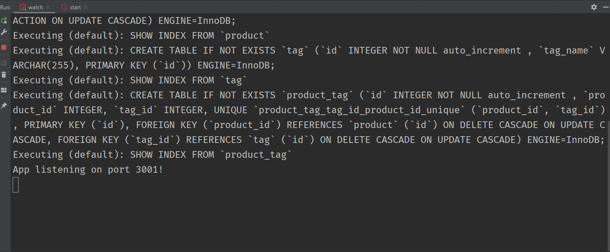
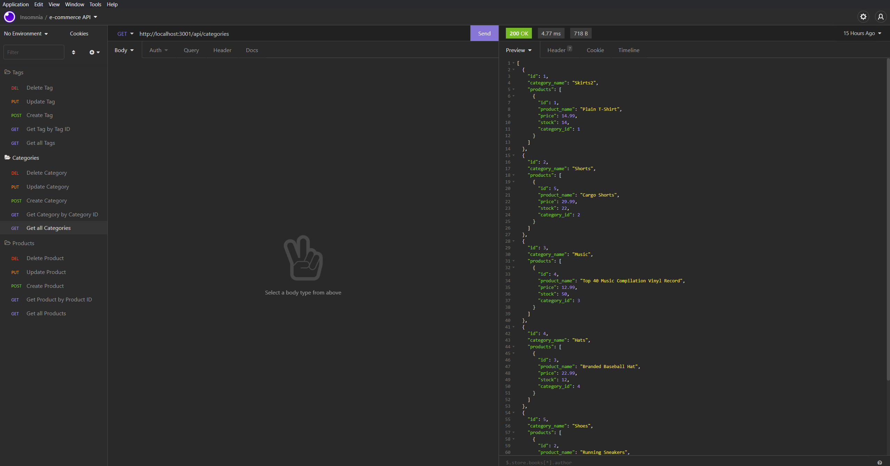
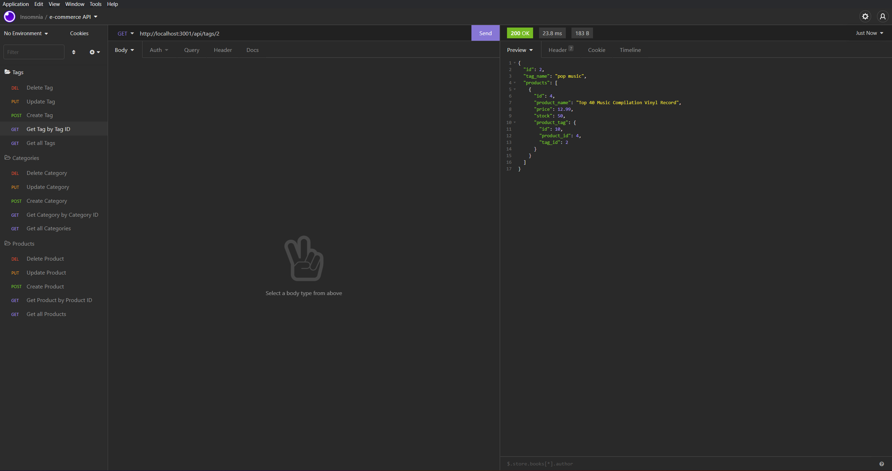

# E-Commerce Back-End

## Description

This application is to build back end for an e-commerce site. It will take a working Express.js API and configure it to use Sequelize to interact with a MySQL database.
The server will handle get, post, put, and delete request to manipulate the database.

## Table of Contents

* [Installation](#Installation)
* [Screenshot](#Screenshot)
* [Video demonstration](#Video demonstration)
* [Contact](#Contact)

## Installation

This application needs MySQL2 and Sequelize packages to connect your Express.js API to a MySQL database and the dotenv package to use environment variables to store sensitive data.

## Screenshot

<pre></pre>
<pre></pre>
<pre></pre>

## Video Demonstration

[Video Demo](https://drive.google.com/file/d/1fstFBNr4hLtiCgyCU6wo_YhCfBqKEB9W/view?usp=sharing)

## Contact

[GitHub](https://github.com/Abi-2021)  
[Email](mailto:abira0607@gmail.com)

